# 🏗️ Architecture - Code Catastrophe Predictor

**Complete system architecture, data flows, and component diagrams**

---

## 📋 Table of Contents

1. [System Overview](#system-overview)
2. [High-Level Architecture](#high-level-architecture)
3. [Core Components](#core-components)
4. [Data Flow](#data-flow)
5. [Multi-Agent System](#multi-agent-system)
6. [Catastrophe Generation Pipeline](#catastrophe-generation-pipeline)
7. [API & Interfaces](#api--interfaces)
8. [Deployment Architecture](#deployment-architecture)

---

## System Overview

Code Catastrophe Predictor is a production failure prediction system powered by Claude Opus 4.6. It analyzes code/architecture descriptions and generates creative, multi-step cascade failure scenarios using adaptive thinking and multi-agent adversarial review.

### Key Capabilities

- **Creative Scenario Generation**: Opus 4.6 imagines novel failure modes
- **Multi-Agent Validation**: Three AI experts debate scenario realism
- **Historical Precedent Matching**: Links predictions to real incidents
- **Risk Analysis**: Automatic scoring and prioritization
- **Multiple Interfaces**: CLI tool, web demo, Python API

---

## High-Level Architecture

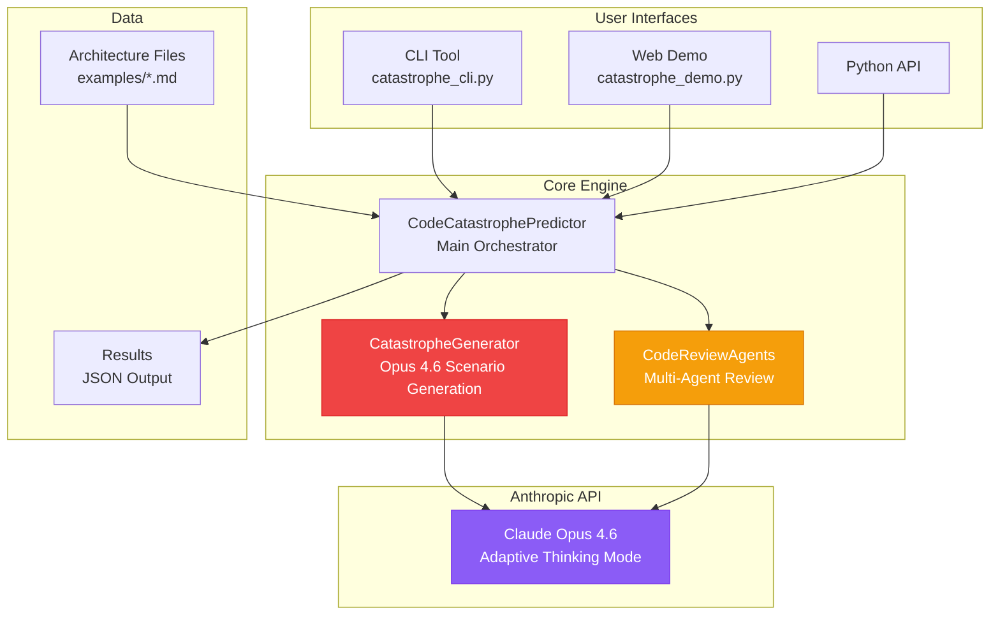

---

## Core Components

### 1. CatastropheGenerator

**Responsibility**: Generate creative production failure scenarios using Opus 4.6

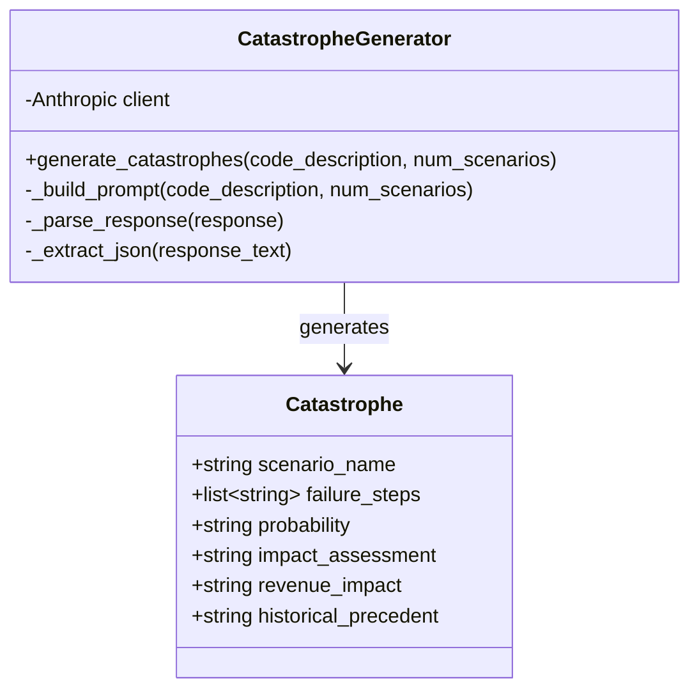

**Key Features**:
- Uses Opus 4.6 with `thinking` parameter for adaptive reasoning
- Handles multi-content block responses (thinking + text)
- Parses structured JSON from natural language
- Validates scenario completeness

### 2. CodeReviewAgents

**Responsibility**: Multi-agent adversarial review of scenarios

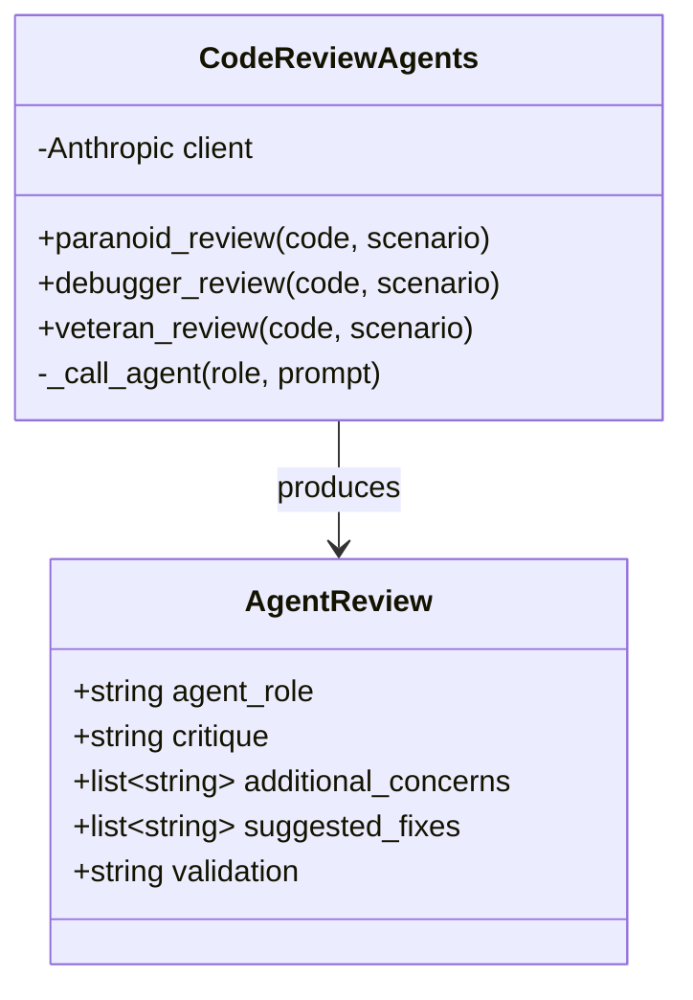

**Three Agents**:
- **Paranoid Engineer**: Finds edge cases, makes scenarios worse
- **Debugger**: Proposes fixes and mitigations
- **Production Veteran**: Validates with real-world experience

### 3. CodeCatastrophePredictor

**Responsibility**: Main orchestrator coordinating generation and review

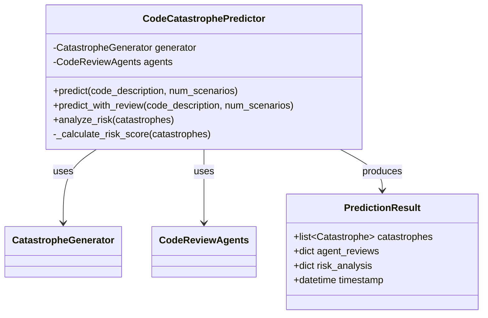

---

## Data Flow

### End-to-End Prediction Flow

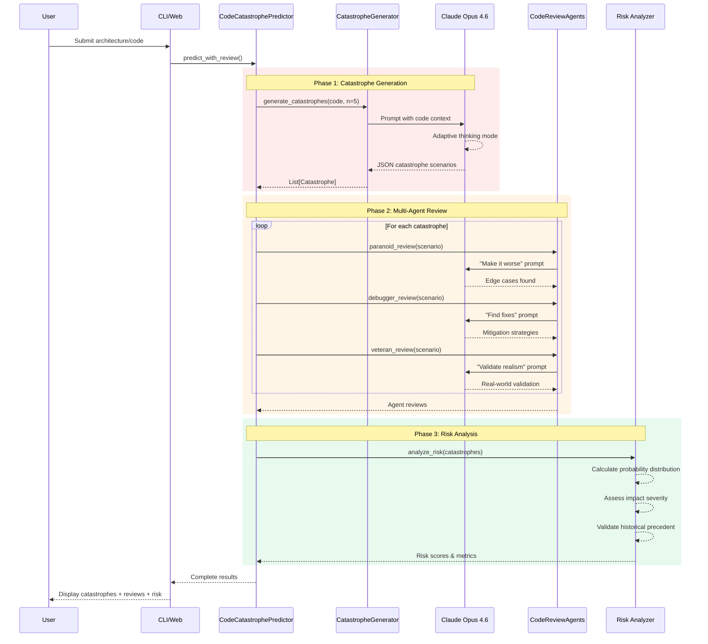

---

## Multi-Agent System

### Agent Interaction Architecture

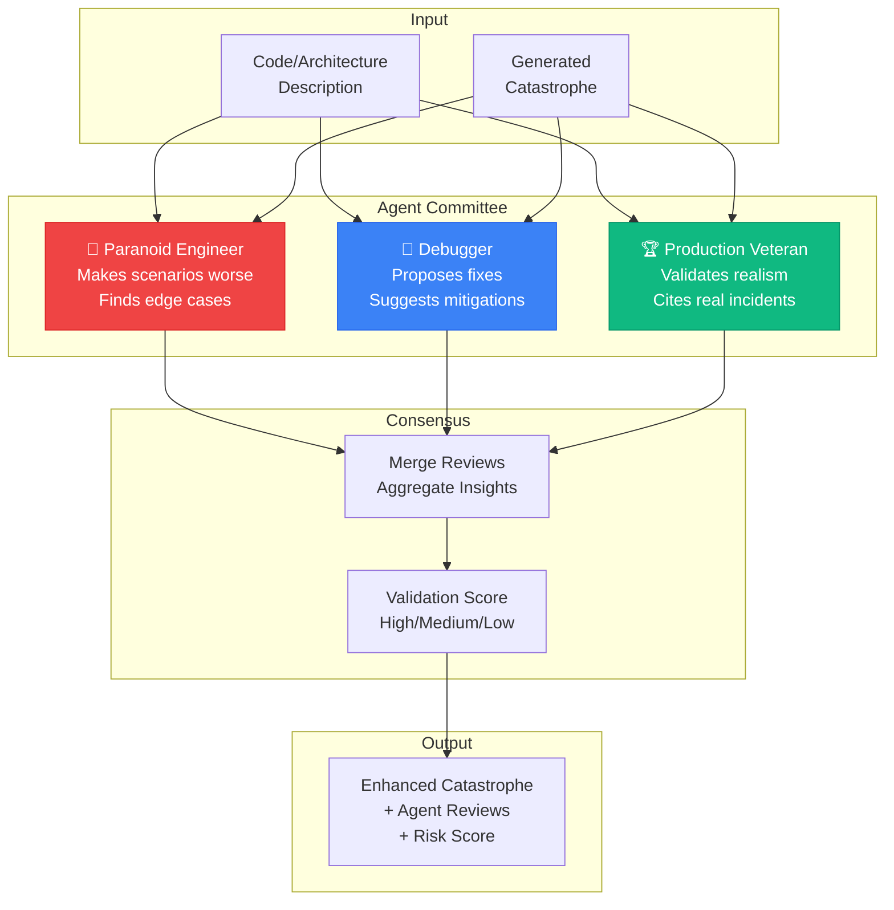

### Agent Prompting Strategy

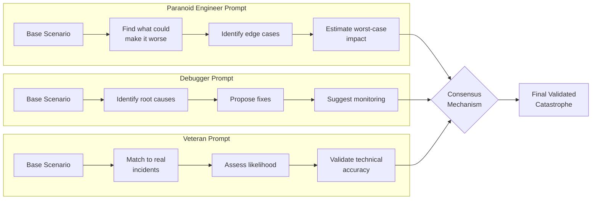

---

## Catastrophe Generation Pipeline

### Opus 4.6 Adaptive Thinking Flow

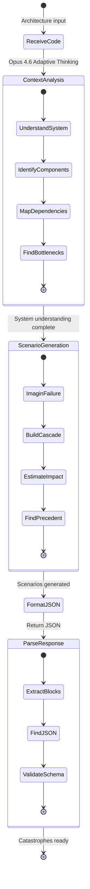

### Content Block Handling

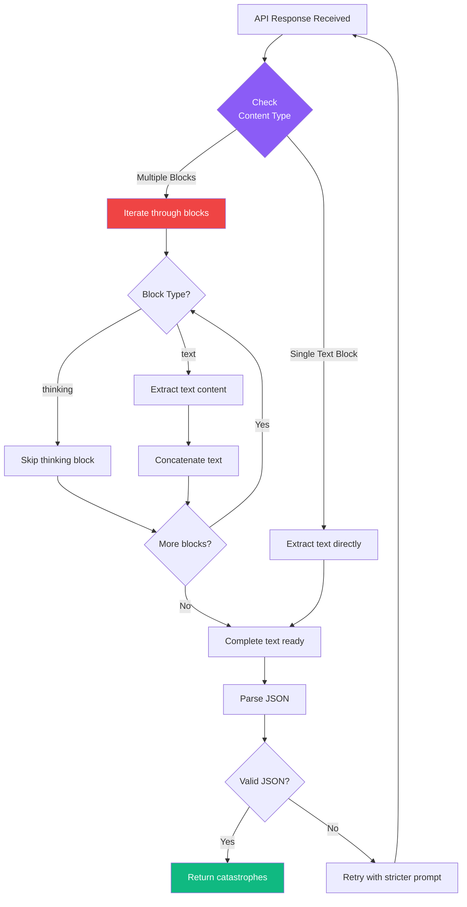

---

## API & Interfaces

### CLI Tool Architecture

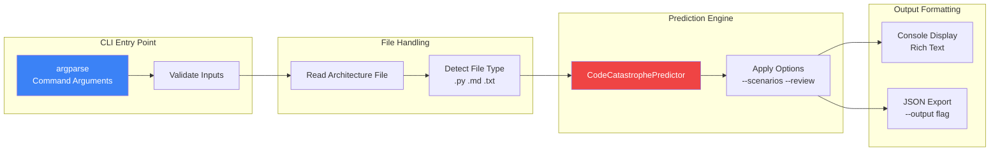

### Web Demo Architecture

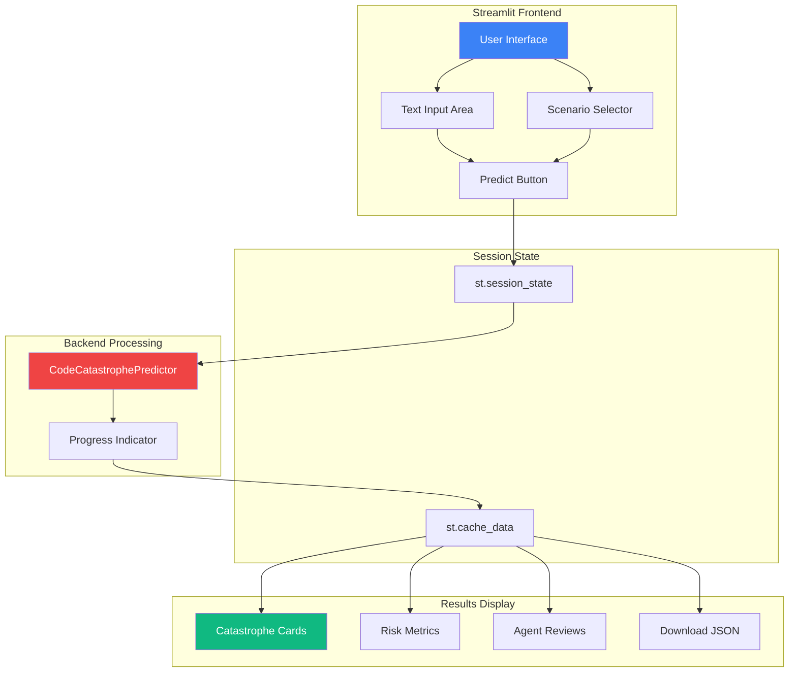

### Python API Usage

```python
# Simple usage
from code_catastrophe_predictor import CodeCatastrophePredictor

predictor = CodeCatastrophePredictor()
results = predictor.predict(
    code_description="Your architecture here...",
    num_scenarios=5
)

# With multi-agent review
results = predictor.predict_with_review(
    code_description="Your architecture here...",
    num_scenarios=3
)

# Access results
for catastrophe in results['catastrophes']:
    print(f"Scenario: {catastrophe['scenario_name']}")
    print(f"Impact: {catastrophe['revenue_impact']}")
    print(f"Steps: {catastrophe['failure_steps']}")

# Risk analysis
risk = predictor.analyze_risk(results['catastrophes'])
print(f"Risk Score: {risk['risk_score']}/10")
```

---

## Deployment Architecture

### Local Development Setup

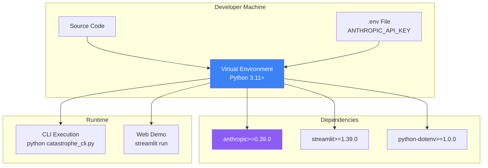

### CI/CD Integration

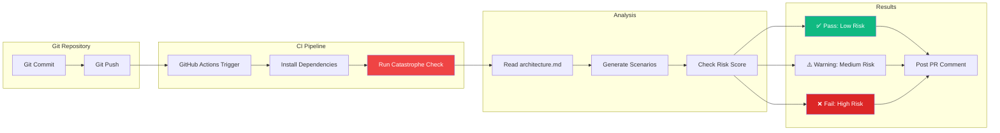

### Example GitHub Action

```yaml
name: Catastrophe Check

on:
  pull_request:
    paths:
      - 'architecture/**'
      - 'src/**'

jobs:
  catastrophe-check:
    runs-on: ubuntu-latest
    steps:
      - uses: actions/checkout@v3

      - name: Set up Python
        uses: actions/setup-python@v4
        with:
          python-version: '3.11'

      - name: Install dependencies
        run: pip install -r requirements_catastrophe.txt

      - name: Run Catastrophe Predictor
        env:
          ANTHROPIC_API_KEY: ${{ secrets.ANTHROPIC_API_KEY }}
        run: |
          python catastrophe_cli.py architecture/system.md \
            --scenarios 5 \
            --threshold 7 \
            --output results.json

      - name: Post PR Comment
        uses: actions/github-script@v6
        with:
          script: |
            const fs = require('fs');
            const results = JSON.parse(fs.readFileSync('results.json'));
            const comment = `## 💀 Catastrophe Analysis\n\n${results.summary}`;
            github.rest.issues.createComment({
              issue_number: context.issue.number,
              owner: context.repo.owner,
              repo: context.repo.repo,
              body: comment
            });
```

---

## Data Structures

### Catastrophe Schema

```json
{
  "scenario_name": "The Black Friday Database Collapse",
  "failure_steps": [
    "PostgreSQL hits IOPS limits at 10K writes/sec",
    "Write latency spikes from 50ms to 5 seconds",
    "Payment timeout rate jumps from 0.1% to 40%",
    "Cart abandonment increases by 300%",
    "Revenue loss: $5-10M in 2 hours"
  ],
  "probability": "medium-high",
  "impact_assessment": "catastrophic - system-wide payment failures",
  "revenue_impact": "$5M-$10M in 2 hours",
  "users_affected": "All active users (500K+ concurrent)",
  "duration": "2-4 hours until emergency read-only mode deployed",
  "historical_precedent": "Similar to 2023 Black Friday Shopify incident..."
}
```

### Agent Review Schema

```json
{
  "paranoid_engineer": {
    "additional_concerns": [
      "Cache invalidation storm could amplify the issue",
      "Retry logic might create thundering herd"
    ],
    "edge_cases": [
      "What if database failover also fails?",
      "Dead letter queue overflow"
    ]
  },
  "debugger": {
    "root_causes": ["Insufficient IOPS provisioning", "No rate limiting"],
    "suggested_fixes": [
      "Implement queue-based write buffering",
      "Add circuit breaker pattern"
    ],
    "monitoring": ["Track write latency p99", "Alert on IOPS > 80%"]
  },
  "production_veteran": {
    "validation": "Highly realistic - matches common patterns",
    "real_incidents": ["Shopify 2023", "Stripe 2022"],
    "likelihood": "7/10 - very possible during peak traffic"
  }
}
```

### Risk Analysis Schema

```json
{
  "risk_score": 8,
  "probability_distribution": {
    "high": 2,
    "medium": 2,
    "low": 1
  },
  "impact_summary": {
    "system_wide": 3,
    "isolated": 2
  },
  "top_concerns": [
    "Database IOPS exhaustion",
    "Payment processing cascade failure"
  ],
  "recommended_actions": [
    "Conduct load testing at 3x peak traffic",
    "Implement circuit breaker on payment flow"
  ]
}
```

---

## Performance Considerations

### Opus 4.6 API Usage

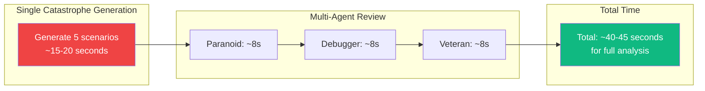

### Optimization Strategies

1. **Batch Processing**: Generate multiple scenarios in one API call (current implementation)
2. **Caching**: Cache results for identical architecture descriptions
3. **Parallel Agent Calls**: Run 3 agents concurrently (future enhancement)
4. **Streaming**: Stream results as they're generated (future enhancement)

### Cost Estimation

```python
# Approximate costs (as of 2026)
OPUS_INPUT_COST = 0.015  # per 1K tokens
OPUS_OUTPUT_COST = 0.075  # per 1K tokens

# Typical usage per analysis:
# - Input: ~2K tokens (architecture) * 4 calls = 8K tokens
# - Output: ~3K tokens per call * 4 = 12K tokens
# Total: ~$0.90-$1.20 per full analysis with multi-agent review
```

---

## Security Considerations

### API Key Management

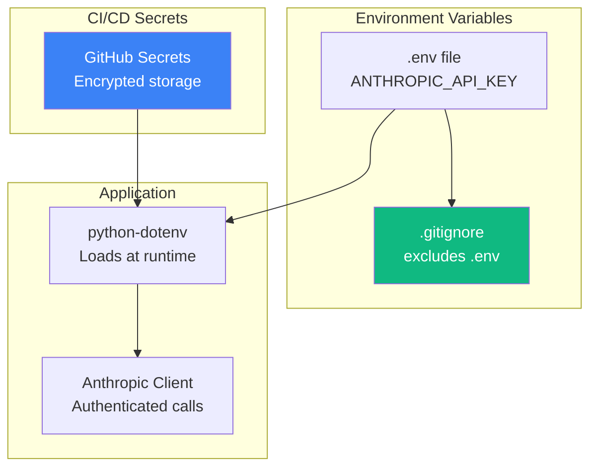

### Input Validation

- Architecture descriptions limited to 50KB
- Number of scenarios capped at 10 per request
- Rate limiting to prevent API abuse
- No execution of generated code (read-only analysis)

---

## Future Enhancements

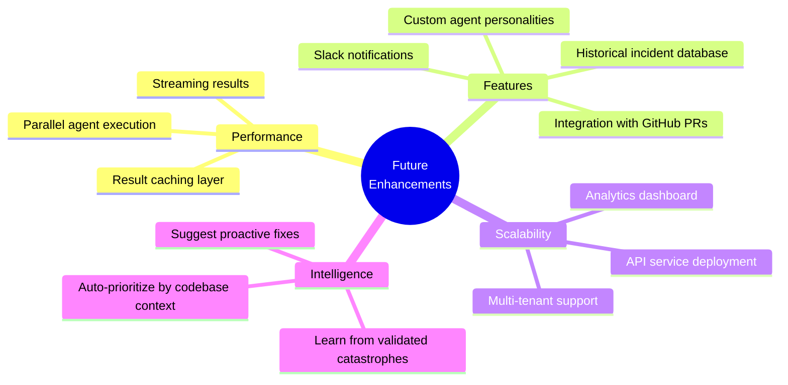

---

## Conclusion

The Code Catastrophe Predictor architecture is designed for:

✅ **Modularity** - Clear separation between generation, review, and analysis
✅ **Extensibility** - Easy to add new agents or interfaces
✅ **Performance** - Optimized API usage with batching
✅ **Reliability** - Multi-agent validation prevents false positives
✅ **Usability** - Multiple interfaces (CLI, Web, API) for different workflows

The system leverages Opus 4.6's unique adaptive thinking capability to discover failure modes that traditional testing cannot imagine, making it a powerful tool for production readiness assessment.

---

**Built with Claude Opus 4.6 | Anthropic Claude Code Hackathon 2026**
